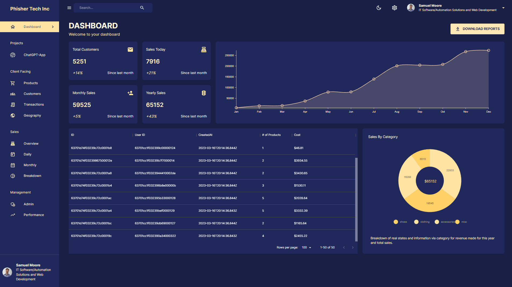

# Dashboard Web App



## Description

Experience the ultimate MERN Stack Admin Dashboard - efficient, user-friendly, and powerful. Manage projects, visualize data with Nivo Charts, and enjoy seamless state management with Redux Toolkit. Our backend runs on Node JS, Express JS, Mongoose, and MongoDB, providing a robust foundation for your success. Take control of your data and productivity today!

## Features

- Powerful and efficient solution for managing your business or project.
- Frontend features:
  - Utilizes Material UI, a popular React UI framework.
  - Ensures a sleek and responsive user interface.
  - Employs Material UI Data Grid for handling large datasets and data organization.
  - Integrates Nivo Charts for data visualization.
- Seamless state management with Redux Toolkit.
- Optimized API requests and improved performance using Redux Toolkit Query.
- Backend features:
  - Utilizes Node JS and Express JS for a robust server-side foundation.
  - Relies on Mongoose for MongoDB object modeling and data management.
- A comprehensive MERN stack for streamlined workflows.
- Real-time data updates.
- Features to enhance productivity and decision-making.
- Suitable for managing projects, data analytics, and team operations.
- A go-to solution for a smooth and powerful user experience.

## Technologies Used

- [MongoDB](https://www.mongodb.com/): A NoSQL database used for persistent data storage.
- [ExpressJS](https://expressjs.com/): A backend framework facilitating the creation of scalable and modular RESTful APIs.
- [ReactJS](https://reactjs.org/): Forms the core of the user interface, enabling dynamic and interactive components.
- [Node.js](https://nodejs.org/): A server-side runtime environment for efficient handling of HTTP requests, database interactions, and business logic implementation.
- [Axios](https://axios-http.com/): A popular HTTP client for making API requests.
- [Redux Toolkit](https://redux-toolkit.js.org/): Simplifies state management in React applications and provides a centralized data flow.
- [Redux Toolkit Query](https://redux-toolkit.js.org/rtk-query/overview): Enhances data fetching and caching, optimizing API requests and improving performance.
- [Mongoose](https://mongoosejs.com/): A MongoDB object modeling tool for data integration and manipulation.
- [Material UI](https://material-ui.com/): A popular React UI framework used for frontend development.
- [Material UI Data Grid](https://material-ui.com/components/data-grid/): Employed for handling large datasets and structured data organization.
- [Nivo Charts](https://nivo.rocks/): Integrated for data visualization, enabling the generation of insightful charts.
- [Redux Toolkit Query](https://redux-toolkit.js.org/rtk-query/overview): A data fetching and caching tool for optimizing API requests.
- [CORS (Cross-Origin Resource Sharing)](https://developer.mozilla.org/en-US/docs/Web/HTTP/CORS): Used to enable secure cross-domain communication for integration with external APIs and services.
- [Context/RESTful API](https://restfulapi.net/rest-architectural-constraints/): Practices used for efficient data management and communication between components, ensuring a scalable and maintainable codebase.

## Getting Started

To run the Stack Overflow Clone locally, follow these steps:

1. Clone the repository to your local machine:

   ```bash
   git clone https://github.com/Mukesh-Sharma400/Dashboard.git
   ```

2. Install all client side dependencies by navigating to the client's root directory and running the following command:

   ```bash
   npm install
   ```

3. Install all server side dependencies by navigating to the server's root directory and running the following command:

   ```bash
   npm install
   ```

4. Create a new .env file same as .env.example and assign the following environment variables.

5. Start the server side by running the following command into the server's root directory:

   ```bash
   npm start
   ```

6. Start the client side by running the following command into the client's root directory:

   ```bash
   npm start
   ```
